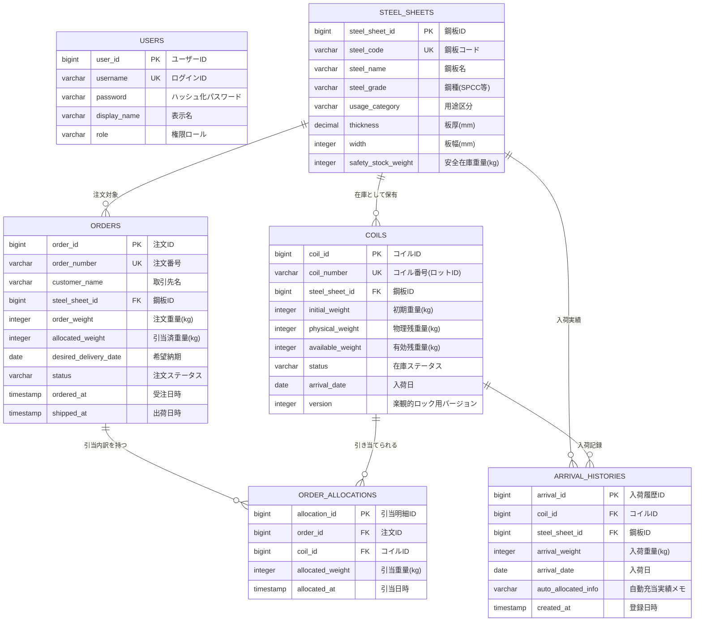

```mermaid
erDiagram
    USERS {
        bigint user_id PK "ユーザーID"
        varchar username UK "ログインID"
        varchar password "ハッシュ化パスワード"
        varchar display_name "表示名"
        varchar role "権限ロール"
    }

    STEEL_SHEETS {
        bigint steel_sheet_id PK "鋼板ID"
        varchar steel_code UK "鋼板コード"
        varchar steel_name "鋼板名"
        varchar steel_grade "鋼種(SPCC等)"
        varchar usage_category "用途区分"
        decimal thickness "板厚(mm)"
        integer width "板幅(mm)"
        integer safety_stock_weight "安全在庫重量(kg)"
    }

    COILS {
        bigint coil_id PK "コイルID"
        varchar coil_number UK "コイル番号(ロットID)"
        bigint steel_sheet_id FK "鋼板ID"
        integer initial_weight "初期重量(kg)"
        integer physical_weight "物理残重量(kg)"
        integer available_weight "有効残重量(kg)"
        varchar status "在庫ステータス"
        date arrival_date "入荷日"
        integer version "楽観的ロック用バージョン"
    }

    ORDERS {
        bigint order_id PK "注文ID"
        varchar order_number UK "注文番号"
        varchar customer_name "取引先名"
        bigint steel_sheet_id FK "鋼板ID"
        integer order_weight "注文重量(kg)"
        integer allocated_weight "引当済重量(kg)"
        date desired_delivery_date "希望納期"
        varchar status "注文ステータス"
        timestamp ordered_at "受注日時"
        timestamp shipped_at "出荷日時"
    }

    ORDER_ALLOCATIONS {
        bigint allocation_id PK "引当明細ID"
        bigint order_id FK "注文ID"
        bigint coil_id FK "コイルID"
        integer allocated_weight "引当重量(kg)"
        timestamp allocated_at "引当日時"
    }

    ARRIVAL_HISTORIES {
        bigint arrival_id PK "入荷履歴ID"
        bigint coil_id FK "コイルID"
        bigint steel_sheet_id FK "鋼板ID"
        integer arrival_weight "入荷重量(kg)"
        date arrival_date "入荷日"
        varchar auto_allocated_info "自動充当実績メモ"
        timestamp created_at "登録日時"
    }

    STEEL_SHEETS ||--o{ COILS : "在庫として保有"
    STEEL_SHEETS ||--o{ ORDERS : "注文対象"
    STEEL_SHEETS ||--o{ ARRIVAL_HISTORIES : "入荷実績"
    ORDERS ||--o{ ORDER_ALLOCATIONS : "引当内訳を持つ"
    COILS ||--o{ ORDER_ALLOCATIONS : "引き当てられる"
    COILS ||--o{ ARRIVAL_HISTORIES : "入荷記録"
```
