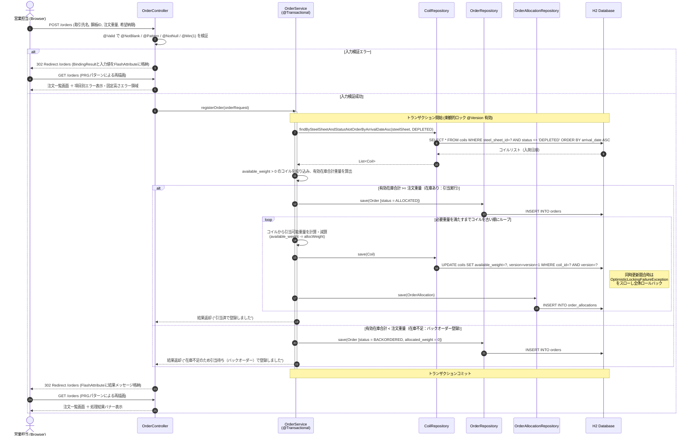

```mermaid
sequenceDiagram
    autonumber
    actor Sales as 営業担当 (Browser)
    participant Ctrl as OrderController
    participant Svc as OrderService<br>(@Transactional)
    participant CoilRepo as CoilRepository
    participant OrderRepo as OrderRepository
    participant AllocRepo as OrderAllocationRepository
    participant DB as H2 Database

    Sales->>Ctrl: POST /orders (取引先名, 鋼板ID, 注文重量, 希望納期)
    Ctrl->>Ctrl: @Valid で @NotBlank / @Pattern / @NotNull / @Min(1) を検証

    alt 入力検証エラー
        Ctrl-->>Sales: 302 Redirect /orders (BindingResultと入力値をFlashAttributeに格納)
        Sales->>Ctrl: GET /orders (PRGパターンによる再描画)
        Ctrl-->>Sales: 注文一覧画面 ＋ 項目別エラー表示・固定高さエラー領域
    else 入力検証成功
        Ctrl->>Svc: registerOrder(orderRequest)
        activate Svc

        Note over Svc, DB: トランザクション開始 (楽観的ロック @Version 有効)
        Svc->>CoilRepo: findBySteelSheetAndStatusNotOrderByArrivalDateAsc(steelSheet, DEPLETED)
        CoilRepo->>DB: SELECT * FROM coils WHERE steel_sheet_id=? AND status <> 'DEPLETED' ORDER BY arrival_date ASC
        DB-->>CoilRepo: コイルリスト（入荷日順）
        CoilRepo-->>Svc: List<Coil>
        Svc->>Svc: available_weight > 0 のコイルを絞り込み、有効在庫合計重量を算出

        alt 有効在庫合計 >= 注文重量（在庫あり：引当実行）
            Svc->>OrderRepo: save(Order [status = ALLOCATED])
            OrderRepo->>DB: INSERT INTO orders

            loop 必要重量を満たすまでコイルを古い順にループ
                Svc->>Svc: コイルから引当可能重量を計算・減算<br>(available_weight -= allocWeight)
                Svc->>CoilRepo: save(Coil)
                CoilRepo->>DB: UPDATE coils SET available_weight=?, version=version+1 WHERE coil_id=? AND version=?
                Note right of DB: 同時更新競合時は<br>OptimisticLockingFailureException<br>をスローし全体ロールバック
                Svc->>AllocRepo: save(OrderAllocation)
                AllocRepo->>DB: INSERT INTO order_allocations
            end
            Svc-->>Ctrl: 結果返却 ("引当済で登録しました")
        else 有効在庫合計 < 注文重量（在庫不足：バックオーダー登録）
            Svc->>OrderRepo: save(Order [status = BACKORDERED, allocated_weight = 0])
            OrderRepo->>DB: INSERT INTO orders
            Svc-->>Ctrl: 結果返却 ("在庫不足のため引当待ち（バックオーダー）で登録しました")
        end

        Note over Svc, DB: トランザクションコミット
        deactivate Svc

        Ctrl-->>Sales: 302 Redirect /orders (FlashAttributeに結果メッセージ格納)
        Sales->>Ctrl: GET /orders (PRGパターンによる再描画)
        Ctrl-->>Sales: 注文一覧画面 ＋ 処理結果バナー表示
    end
```
