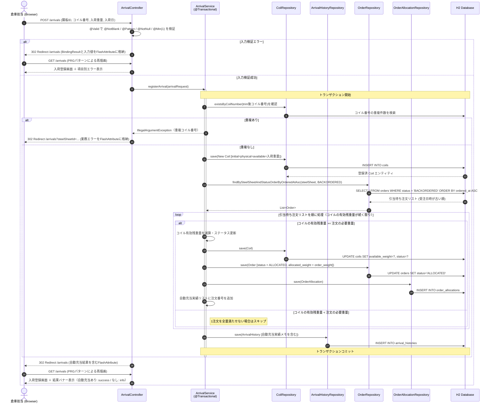

```mermaid
sequenceDiagram
    autonumber
    actor Warehouse as 倉庫担当 (Browser)
    participant Ctrl as ArrivalController
    participant Svc as ArrivalService<br>(@Transactional)
    participant CoilRepo as CoilRepository
    participant HistRepo as ArrivalHistoryRepository
    participant OrderRepo as OrderRepository
    participant AllocRepo as OrderAllocationRepository
    participant DB as H2 Database

    Warehouse->>Ctrl: POST /arrivals (鋼板ID, コイル番号, 入荷重量, 入荷日)
    Ctrl->>Ctrl: @Valid で @NotBlank / @Pattern / @NotNull / @Min(1) を検証

    alt 入力検証エラー
        Ctrl-->>Warehouse: 302 Redirect /arrivals (BindingResultと入力値をFlashAttributeに格納)
        Warehouse->>Ctrl: GET /arrivals (PRGパターンによる再描画)
        Ctrl-->>Warehouse: 入荷登録画面 ＋ 項目別エラー表示
    else 入力検証成功
        Ctrl->>Svc: registerArrival(arrivalRequest)
        activate Svc

        Note over Svc, DB: トランザクション開始
        Svc->>CoilRepo: existsByCoilNumber(trim後コイル番号)を確認
        CoilRepo->>DB: コイル番号の重複件数を検索

        alt 重複あり
            Svc-->>Ctrl: IllegalArgumentException（重複コイル番号）
            Ctrl-->>Warehouse: 302 Redirect /arrivals?steelSheetId=... (業務エラーをFlashAttributeに格納)
        else 重複なし
            Svc->>CoilRepo: save(New Coil [initial=physical=available=入荷重量])
            CoilRepo->>DB: INSERT INTO coils
            DB-->>CoilRepo: 登録済 Coil エンティティ

            Svc->>OrderRepo: findBySteelSheetAndStatusOrderByOrderedAtAsc(steelSheet, BACKORDERED)
            OrderRepo->>DB: SELECT * FROM orders WHERE status = 'BACKORDERED' ORDER BY ordered_at ASC
            DB-->>OrderRepo: 引当待ち注文リスト (受注日時が古い順)
            OrderRepo-->>Svc: List<Order>

            loop 引当待ち注文リストを順に処理（コイルの有効残重量が続く限り）
                alt コイルの有効残重量 >= 注文の必要重量
                    Svc->>Svc: コイル有効残重量を減算・ステータス更新
                    Svc->>CoilRepo: save(Coil)
                    CoilRepo->>DB: UPDATE coils SET available_weight=?, status=?
                    Svc->>OrderRepo: save(Order [status = ALLOCATED, allocated_weight = order_weight])
                    OrderRepo->>DB: UPDATE orders SET status='ALLOCATED'
                    Svc->>AllocRepo: save(OrderAllocation)
                    AllocRepo->>DB: INSERT INTO order_allocations
                    Svc->>Svc: 自動充当実績リストに注文番号を追加
                else コイルの有効残重量 < 注文の必要重量
                    Note right of Svc: 1注文を全量満たせない場合はスキップ
                end
            end

            Svc->>HistRepo: save(ArrivalHistory [自動充当実績メモを含む])
            HistRepo->>DB: INSERT INTO arrival_histories
            Note over Svc, DB: トランザクションコミット
        end
        deactivate Svc

        Ctrl-->>Warehouse: 302 Redirect /arrivals (自動充当結果を含むFlashAttribute)
        Warehouse->>Ctrl: GET /arrivals (PRGパターンによる再描画)
        Ctrl-->>Warehouse: 入荷登録画面 ＋ 結果バナー表示（自動充当あり: success / なし: info）
    end
```
